# Git Command Examples with Screenshots

This guide provides practical Git commands with explanations and screenshots from my local environment.

### git init
Initialize new Git repository

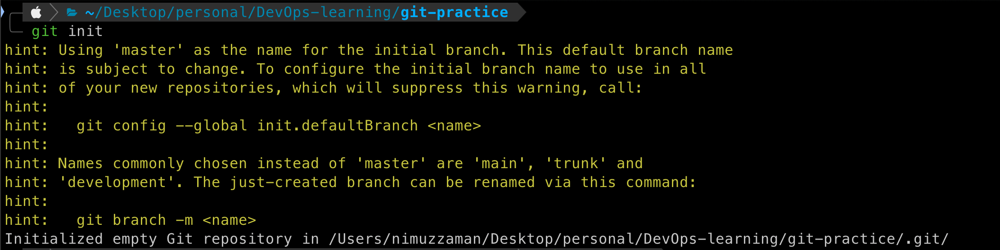

### git status
Shows git current state

### git clone
Clone a remote repository to any directory.

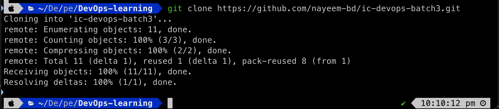

### git add
Add file to git track this changes.

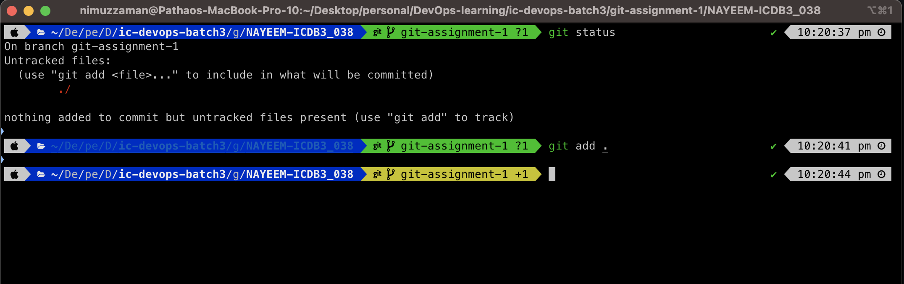

### git commit
Commit staged changes

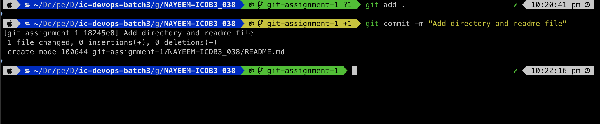

### git push
Push changes to remote repository

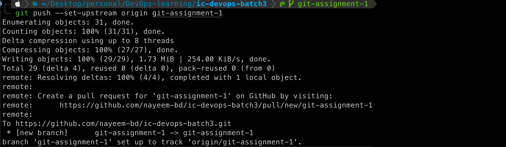

### git branch
Create, show and manage branches

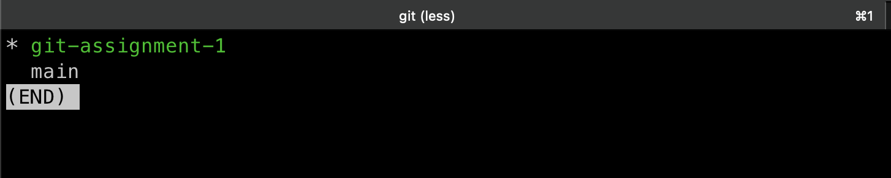

### git checkout
Switch between branches & commits

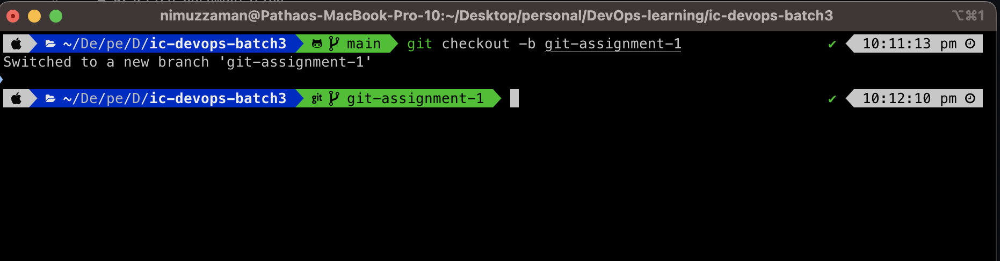

### git fetch
Fetch changes from remote

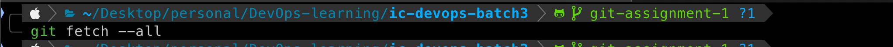

### git pull
Pull changes from remote or rebasing

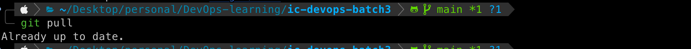

### git stash
Stash changes temporarily

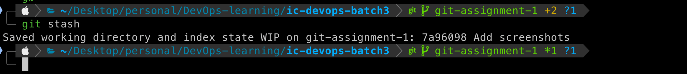
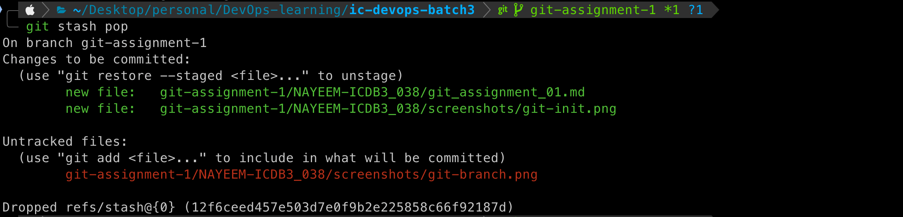

### git rebase
Rebase commits

